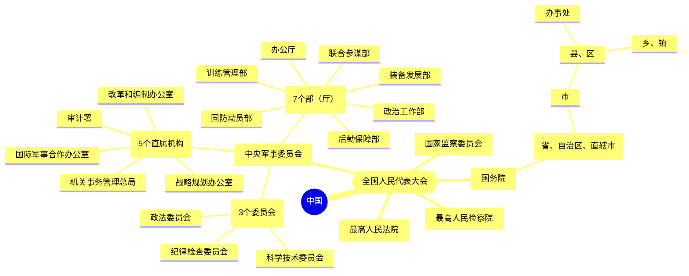
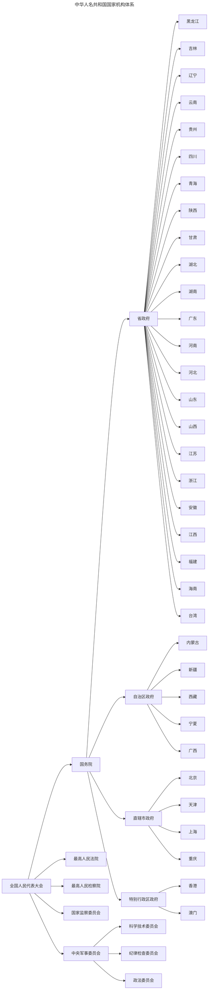
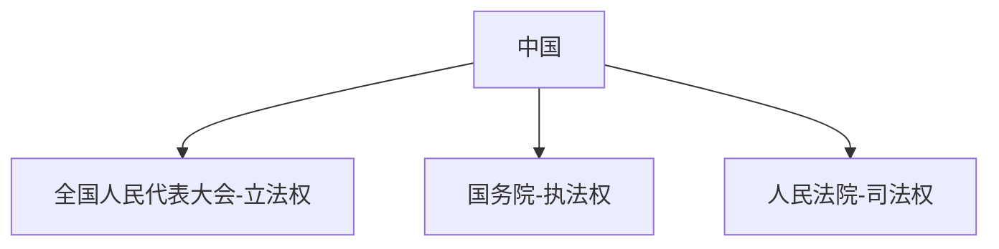
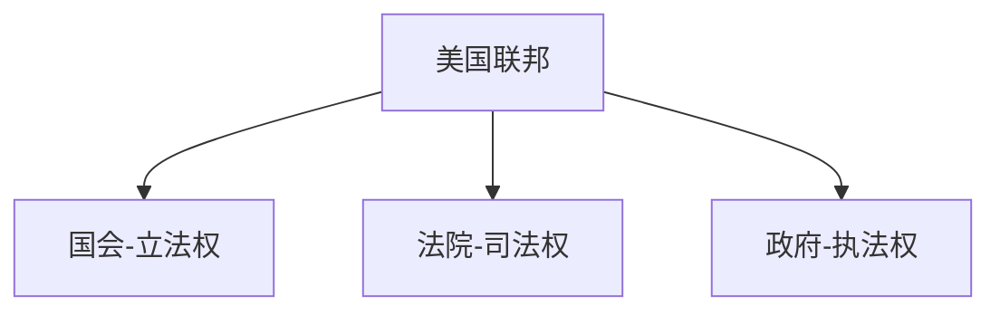
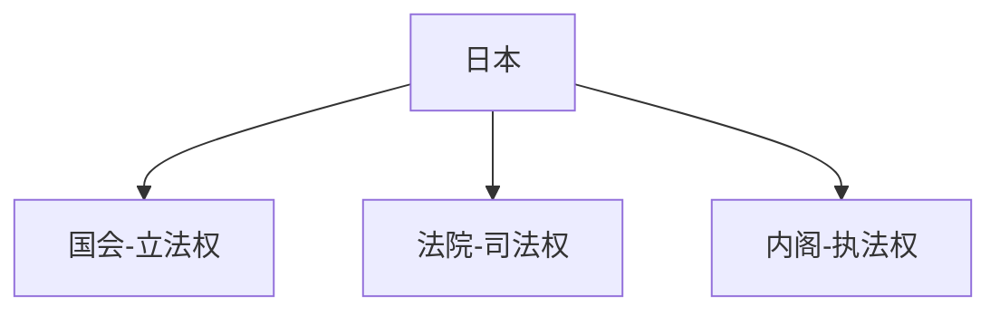

```mermaid
mindmap
  中国((中国))
    {{全国人民代表大会}}
      [国务院]
        (省、自治区、直辖市)
          市
            县、区
              办事处
              乡、镇
      [中央军事委员会]
        (3个委员会)
         纪律检查委员会
         政法委员会
         科学技术委员会
        (5个直属机构)
          战略规划办公室
          改革和编制办公室
          国际军事合作办公室
          审计署
          机关事务管理总局
        (7个部（厅）)
         办公厅
         联合参谋部
         政治工作部
         后勤保障部
         装备发展部
         训练管理部
         国防动员部
      [国家监察委员会]
      [最高人民法院]
      [最高人民检察院]
    
   

```

```mermaid
---
title: 中华人名共和国国家机构体系
---
flowchart LR
    rd[全国人民代表大会]
    rd --> gwy[国务院]
      gwy --> szf[省政府]
        szf --> 黑龙江
        szf --> 吉林
        szf --> 辽宁
        szf --> 云南
        szf --> 贵州
        szf --> 四川
        szf --> 青海
        szf --> 陕西
        szf --> 甘肃
        szf --> 湖北
        szf --> 湖南
        szf --> 广东
        szf --> 河南
        szf --> 河北
        szf --> 山东
        szf --> 山西
        szf --> 江苏
        szf --> 浙江
        szf --> 安徽
        szf --> 江西
        szf --> 福建
        szf --> 海南
        szf --> 台湾
      gwy --> zzq[自治区政府]
        zzq --> 内蒙古
        zzq --> 新疆
        zzq --> 西藏
        zzq --> 宁夏
        zzq --> 广西
      gwy --> zxs[直辖市政府]
        zxs --> 北京
        zxs --> 天津
        zxs --> 上海
        zxs --> 重庆
      gwy --> tbxzq[特别行政区政府]
        tbxzq --> 香港
        tbxzq --> 澳门
    rd --> fy[最高人民法院]
    rd --> jcy[最高人民检察院]
    rd --> jcw[国家监察委员会]
    rd --> jw[中央军事委员会]
      jw --> 科学技术委员会
      jw --> 纪律检查委员会
      jw --> 政法委员会
```

## 中国国家机构

``` mermaid
---
title 中国国家机构
---
flowchart TD
zh[中国]
zh --> 全国人民代表大会-立法权
zh --> 国务院-执法权
zh --> 人民法院-司法权
```

## 美国三权分立

```mermaid
---
title 美国三权分立制度机构体系
---
flowchart TD
lb[美国联邦]
lb --> gh[国会-立法权]
lb --> fy[法院-司法权]
lb --> zf[政府-执法权]
```

## 日本政治制度

```mermaid
---
title 美国三权分立制度机构体系
---
flowchart TD
lb[日本]
lb --> gh[国会-立法权]
lb --> fy[法院-司法权]
lb --> zf[内阁-执法权]
```

