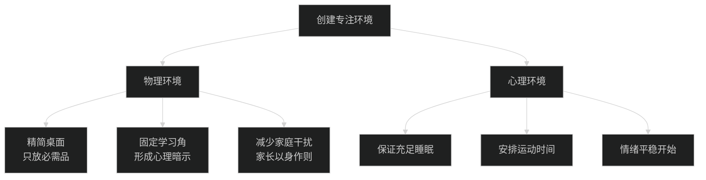
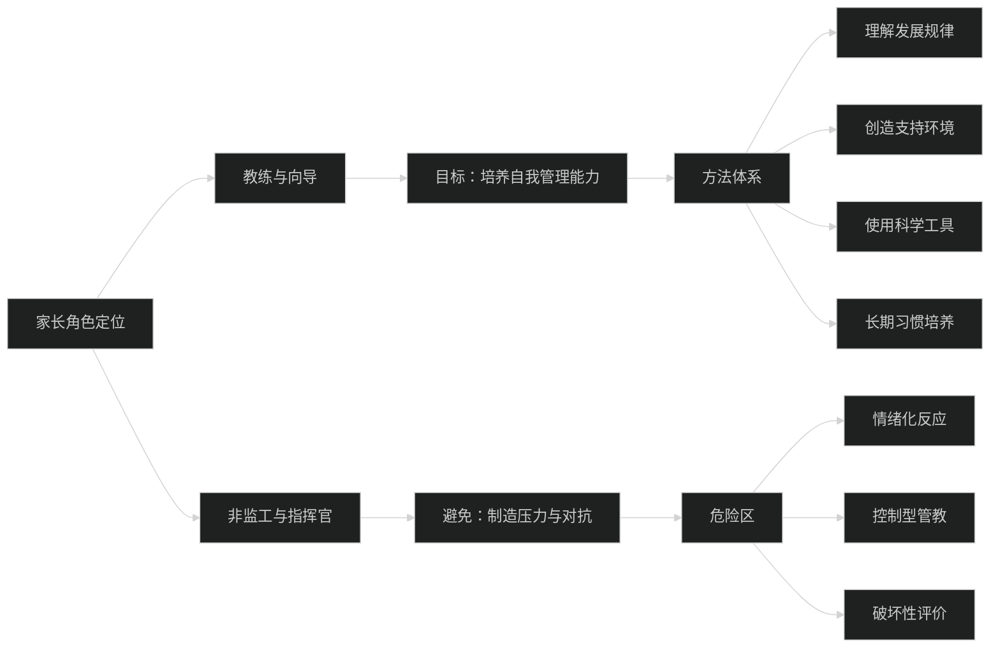
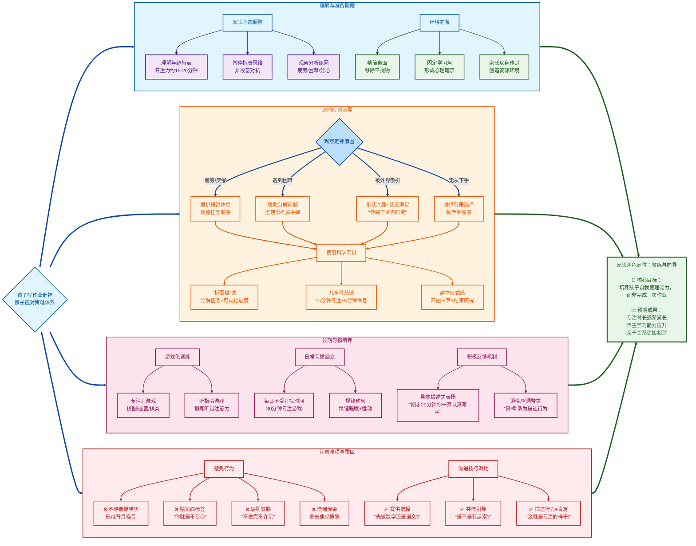

面对孩子写作业走神，家长的应对方式至关重要。处理得当，能帮助孩子学会专注；处理不当，则可能让孩子产生厌学情绪，破坏亲子关系。

核心是 **“理解、引导而非控制”**

### 第一步：先处理心情，再处理事情——家长的心态调整

1. **理解这是正常现象**：二年级孩子的平均专注时长大约在15-20分钟。大脑还在发育，容易被外界事物吸引。告诉自己：“他不是在故意对抗，只是大脑需要休息或转换。”
2. **按住“火气”，观察原因**：别立刻批评。悄悄观察一下，他是在为什么走神？
   - **累了？** 作业前是否进行了剧烈活动？
   - **难了？** 是不是遇到不会的题目，产生了畏难情绪？
   - **烦了？** 作业量是否看起来太多，让他无从下手？
   - **被吸引了？** 桌上有玩具，旁边有声音，心里惦记着动画片？

### 第二步：创造利于专注的“物理环境”

1. **精简桌面**：桌上只放当前作业必需的文具和书本，拿走玩具、零食、电子产品等一切无关物品。
2. **建立“学习角”**：固定一个安静、明亮、整洁的地方专门用于学习，形成心理暗示：“坐在这里就是要专心做事。”
3. **减少干扰**：家长在此期间也尽量不看电视、不刷手机（至少不要在孩子视线范围内），可以在一旁安静地看书、工作，以身作则。

### 第三步：使用科学的方法帮助孩子进入和保持状态

1. **“拆蛋糕”法分解任务**：把一大堆作业比喻成一个“大蛋糕”，和孩子一起“切”成几小块。
   - “我们先花10分钟‘吃掉’这5道数学题，然后休息一下。”
   - 每完成一小块，就画个星星或打个勾，让孩子有清晰的**成就感**和**进度感**。
2. **使用“番茄钟工作法”（儿童版）**：
   - 跟孩子约定：“我们定一个15分钟的闹钟，这15分钟里，我们一起像小士兵一样专心战斗，闹钟响了就休息5分钟。”
   - 可以用有趣的计时器（如沙漏、卡通造型的闹钟）来增加趣味性。
3. **“开始仪式”与“结束仪式”**：
   - **开始**：可以和孩子击个掌，说“学习时间到，大脑引擎启动！” 赋予一种正式感。
   - **结束**：完成后，一起把书本收拾好，庆祝一下：“任务完成，你真棒！”

### 第四步：当走神发生时，如何温柔而坚定地拉回注意力

1. **用提醒代替责备**：
   - **错误说法**：“你怎么又发呆！专心点！”
   - **正确做法**：走过去，轻轻摸摸他的头或肩膀，用平静的语气问：“是不是想到什么有趣的事了？我们先把它记在心里，等做完作业再和妈妈分享好吗？” 或者指指作业本：“我们的‘闯关游戏’进行到第三题了，看看下一题是什么怪兽？”
2. **提供有限的选择，赋予掌控感**：
   - “你是想先攻克数学怪兽，还是先打败语文巨人？”
   - “我们是做完这一页休息，还是做完这两道题就休息？”（两个选择都是你要的方向）
3. **将走神转化为连接点**：如果他是因为想到别的事而走神，可以承认他的想法，并承诺稍后关注。
   - “你画的这个机器人真酷！等我们作业完成后，你当小老师教我怎么画好不好？现在我们得先完成任务。”

### 第五步：长期培养专注力的习惯

1. **保证充足的睡眠和运动**：这是专注力的生理基础。每天要有足够的户外活动时间。
2. **每天有一段“不受打扰”的专注游戏时间**：无论是搭积木、看书还是画画，在此期间不要喂水、问问题，让他沉浸其中。这能锻炼大脑“保持专注”的肌肉。
3. **多玩需要专注的游戏**：比如拼图、找不同、迷宫、棋类游戏、听指令做动作等。
4. **真诚且具体的表扬**：不要只说“你真专心”，要描述你看到的行为：
   - “刚才那20分钟，你眼睛一直看着书本，手在认真写，这就是‘专注’的样子，太厉害了！”

### 需要避免的“雷区”：

- **不停地催促、唠叨**：这会形成“背景噪音”，孩子反而学会屏蔽你的声音。
- **贴负面标签**：“你就是个不专心的孩子。” 标签会让孩子自我认同为那样的人。
- **惩罚或威胁**：“做不完不许玩！不许吃饭！” 这会将学习和痛苦的感受绑定。
- **家长情绪失控**：你的焦虑和怒火会传染给孩子，让他更难平静下来思考。

**总结一下核心心法：**
你不是一个**监工**，而是一个**教练**和**向导**。你的目标不是“盯”着他写完作业，而是**帮助他获得“自己能管理好自己”的能力和信心**。从理解开始，用方法引导，用耐心陪伴，你会发现，孩子专注的时间会越来越长，而你们之间的战斗也会越来越少。

这个过程也许很慢，但请相信，你每一次温和而坚定的引导，都在为孩子未来的自律大厦添砖加瓦。

### 创建专注环境

### 💡 核心原则总结

### 沟通技巧对比表

| 推荐方式                                                   | 避免方式                      | 原理分析                         |
| :--------------------------------------------------------- | :---------------------------- | :------------------------------- |
| **描述行为+肯定** “刚才20分钟你一直认真写字，这就是专注！” | **空洞表扬** “真棒！好孩子！” | 具体描述让孩子明白什么行为被认可 |
| **提供选择** “我们先做这页还是先休息5分钟？”               | **命令威胁** “不做完不许玩！” | 有限选择赋予掌控感，减少权力斗争 |
| **共情+引导** “是不是有点累？我们调整一下节奏”             | **贴标签** “你就是不专心！”   | 共情连接情绪，标签会固化负面行为 |

### ⚠️ 家长行为警示表

| 雷区类型       | 具体表现                           | 潜在后果                           |
| :------------- | :--------------------------------- | :--------------------------------- |
| **过度干预**   | 不停催促、唠叨、坐在旁边紧盯每个字 | 孩子产生依赖，无法自主管理         |
| **负面强化**   | 惩罚威胁、取消休息、饭点惩罚       | 将学习与痛苦感受绑定，产生厌学情绪 |
| **情绪传染**   | 家长焦虑、愤怒、不耐烦             | 孩子情绪更难平静，陷入恶性循环     |
| **破坏性比较** | “看看别人家孩子...”                | 损害自尊，产生逆反心理             |

