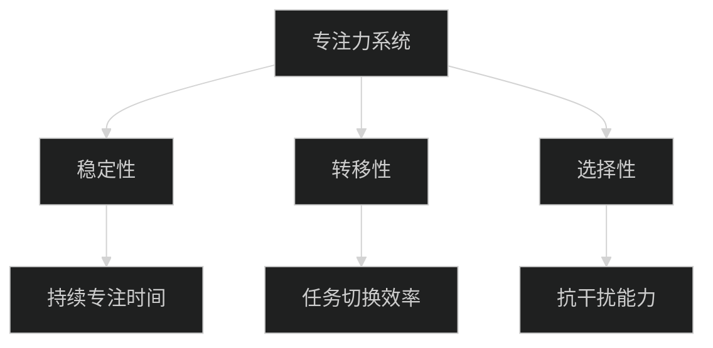
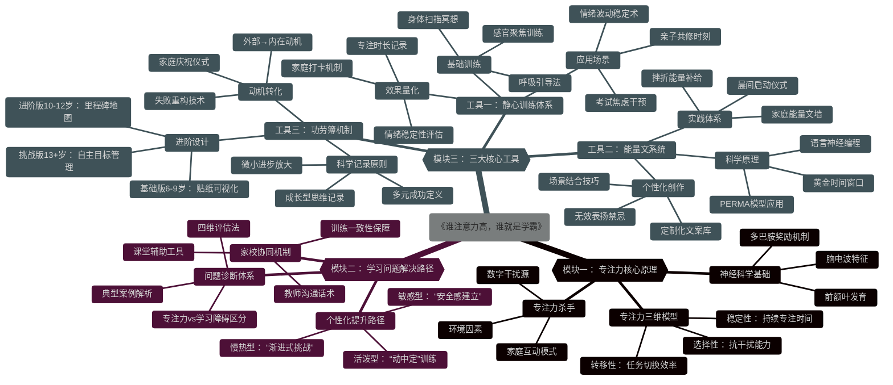

###  模块一：揭密专注力提升核心原理（第1-2周）

#### 1.1 专注力的神经科学基础

- 大脑前额叶发育与专注力的关联性
- 多巴胺奖励机制如何塑造学习专注度
- 儿童脑电波特征与最佳学习时段识别

#### 1.2 专注力的三大维度

- 稳定性（持续专注）
- 转移性（任务切换）
- 选择性（抗干扰）



#### 1.3 专注力杀手识别与应对

- 数字干扰源量化评估（屏幕时间/通知频率）
- 环境因素的科学优化（光线/声音/空间）
- 家庭互动模式对专注力的隐性影响

### 模块二：解决孩子学习问题的科学路径（第3-4周）

#### 2.1 学习问题诊断体系

- 专注力问题与学习障碍的区分标准
- 四维评估法：行为观察/情境测试/家长问卷/教师反馈
- 典型案例解析：多动倾向vs专注力不足vs学习动机缺失

#### 2.2 个性化提升路径设计

- 基于气质类型的专注力培养策略
  - 活泼型孩子的"动中定"训练
  - 敏感型孩子的"安全感建立"路径
  - 慢热型孩子的"渐进式挑战"方案
- 学科适配原则：数学/语文/外语不同场景的专注力要求

#### 2.3 家校协同机制

- 教师沟通话术库：如何有效表达孩子专注力需求
- 课堂专注力辅助工具包
- 家庭-学校训练一致性保障方案

### 模块三：提升学习能力三大核心工具（第5-8周）

#### 🔹 工具一：静心训练体系 —— 提升稳定度、自控力、情绪管理

环境布置原则：

1.创造一个相对安静、独立的学习环境
2.书桌不要布置在客厅和厨房
3.尽量避免对孩子进行人为的干扰,
4.桌内东西摆放有序，干净整洁
5.把与学习无关的书籍、物品清理干净

**3.1 基础训练序列**

- 呼吸引导法（4-7-8呼吸法儿童版）
- 感官聚焦训练（听觉/视觉/触觉定向练习）
- 身体扫描冥想（10分钟儿童适配版）

**3.2 进阶应用场景**

- 情绪波动时的5分钟稳定术
- 考试焦虑的即时干预方案
- 亲子共修：家庭静心时刻建立

**3.3 训练效果量化**

- 专注时长记录表（可视化进步）
- 情绪稳定性评估指标
- 家庭练习打卡机制设计

#### 🔹 工具二：能量文系统 —— 补充孩子心理营养

读能量文有几个要求 ：

①　用真心去读，带着你真实的情感[爱心]

②　坚持每天读，不要三天打鱼两天晒网⚠

③　在实际生活中践行，而不仅仅是口头读[跳跳]

④　不要只期待孩子的反应，多关注自己的投入

**3.4 能量文科学原理**

- 积极心理学PERMA模型在儿童教育中的应用
- 语言神经编程(NLP)对大脑重塑的影响
- 每日肯定语的黄金时间窗口

**3.5 个性化能量文创作**

```
[模板] 我看到你______（具体行为），这说明你是一个______（品质）的孩子。
[示例] "我看到你今天主动整理了书桌，这说明你是一个负责任的孩子。"
```

- 基于孩子优势的定制化文案库
- 避免无效表扬的3个禁忌
- 能量文与学习场景的结合技巧

**3.6 实践体系**

- 晨间能量启动仪式（2分钟）
- 挫折时刻能量补给包
- 家庭能量文墙设计与维护

#### 🔹 工具三：功劳簿机制 —— 建立孩子学习上的自信

写功劳簿的目的：

1、改善大人负面语言习惯

2、调整经常只看缺点的习惯

3、给孩子送鼓励&心理营养，自信是解决很多问题的关键，也是重建孩子自信、自控力、积极性的关键！

**3.7 科学记录原则**

- 成长型思维记录法：关注过程而非结果
- 微小进步放大技术
- 多元成功定义：学术/社交/情绪/创造力

**3.8 功劳簿进阶设计**

| 基础版（6-9岁） | 进阶版（10-12岁） | 挑战版（13+岁）    |
| --------------- | ----------------- | ------------------ |
| 贴纸可视化系统  | 挑战里程碑地图    | 自主目标管理系统   |
| 家长主导记录    | 亲子共同记录      | 学生主导，家长引导 |
| 即时反馈机制    | 延迟满足训练      | 长期规划能力培养   |

**3.9 动机转化技术**

- 从外部奖励到内在动机的过渡策略
- 失败重构：如何将挫折转化为功劳簿内容
- 家庭庆祝仪式设计：强化成就体验

------

## 课程特色与差异化

### 📊 三维评估体系

1. **前测**：专注力基线评估（含注意力商数AQ测试）
2. **过程监测**：每周能力变化追踪
3. **结业评估**：综合能力提升报告+后续成长计划

### 🛠️ 家长赋能工具包

- 21天专注力训练日历
- 课堂干扰应对急救卡
- 亲子沟通话术手册
- 专注力食物营养指南

### 🌈 特色实践项目

- **"15分钟心流"挑战**：渐进式延长专注时间
- **家庭无屏幕日**：重建真实互动与专注习惯
- **专注力主题亲子游**：将训练融入生活场景



## 能量文

《宝贝有你真好》
______很高兴你来到这个家。
爸爸妈妈的心肝宝贝。你是个多么可爱的宝贝。我们很高兴成为你的父母，
很感谢有你的陪伴。
很高兴你是个男孩/女孩。
你是独一无二、最珍贵的宝贝。
你是健康可爱的乖宝贝。
你是爸爸妈妈的心肝宝贝。
你不需要成为什么我们才爱你。
我们爱你，因为你就是你。
你不需要和别人做比较，也不需要比谁好。
我们就爱你这个样子。无论如何，我们就是爱全部的你。
世界上没有任何人可以取代你。我们就是爱你。
你对我们的意义非凡。
我们会照顾你、陪伴着你长大。
我们会尽我们所能让你感到安全与被爱。
你是蒙受恩宠的。你是蒙受祝福的。你是被深爱着的。
你是上天赐给我们最珍贵的宝贝。
你是完美无缺的宝贝，你是为了教会我们爱、帮助我们的灵魂的进展而来的:
你是为了发挥你独特的天分、1展现你的爱与善与美而来的!
在你身边将有很多人陪伴你、协助你、支持你发挥你独特的天赋和才能!
这个世界因为有你而更完整、更美好,这个家因为有你而更幸福、更温暖。
我们真的很爱你。我们就是爱你。
宝贝，有你真好。我们会珍爱你一辈子
宝贝，爸爸妈妈爱你。宝贝，感谢有你。
宝贝，感谢你。