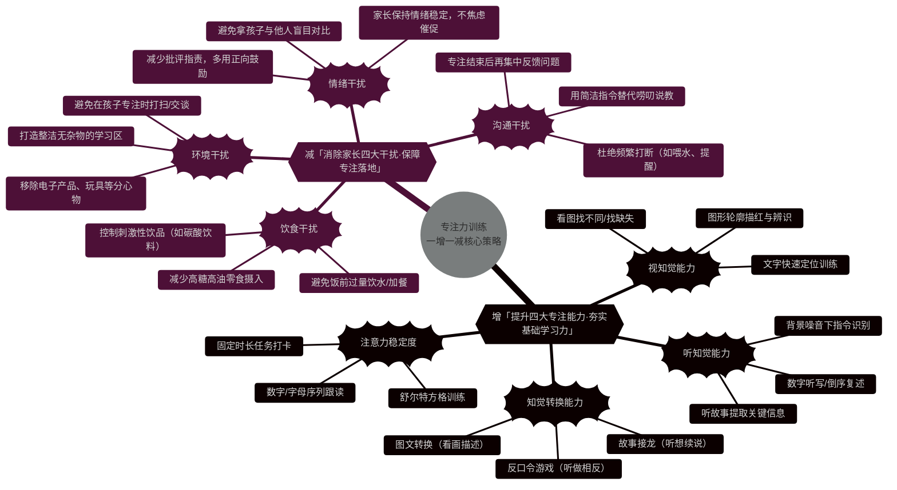

# 专注力训练 一增一减

专注力训练中的 “一增一减” 是一套系统化的培养策略，核心是**增加孩子的核心专注能力**、**减少内外干扰因素**，从内因和外因两方面双管齐下提升专注力，尤其适用于儿童专注力培养场景。

### 一、“增”：强化专注力的核心能力

这是从**内因**入手，通过针对性训练提升孩子的基础专注能力与内在动力，是专注力提升的核心抓手。

1. **提升基础专注能力维度**
   - **注意力稳定度**：通过舒尔特方格、听数字训练等方式，延长孩子对单一任务的专注时长。比如舒尔特方格训练让孩子按顺序找数字，从简单的 5×5 方格逐步升级到 8×8 方格，循序渐进强化注意力的持续性。
   - **视知觉与听知觉能力**：通过看图找不同、听故事回答问题等训练，提升孩子对视觉、听觉信息的捕捉和处理能力，避免因感知能力不足导致的注意力分散。
   - **知觉转换能力**：借助反口令游戏、故事接龙等游戏化训练，锻炼孩子在 “看、听、做” 之间的转换能力，比如反口令游戏中孩子需快速执行与指令相反的动作，提升大脑的灵活性。
2. **增强内在动力与自信心**
   - 设定阶段性小目标并配合正向激励，比如完成作业后给予自由活动时间或口头表扬，激活大脑的奖赏回路，让孩子从 “被动专注” 变为 “主动专注”。
   - 赋予孩子学习自主权，让其决定作业顺序、制定小目标，比如 “本周完成 3 个错题本”，通过掌控感提升专注的意愿。

### 二、“减”：消除专注力的干扰因素

这是从**外因**入手，减少环境、行为、情绪等方面的干扰，为专注力培养创造良好条件。

1. **减少环境干扰**
   - 打造安静、整洁的学习空间，移除电子产品、玩具等无关物品，研究显示杂乱环境会分散孩子 30% 以上的注意力。
   - 避免家长频繁打断孩子，比如写作业时反复询问 “要不要喝水”，这种行为会破坏孩子的专注节奏。
2. **减少行为与情绪干扰**
   - 让孩子 “一次只做一件事”，比如写作业时关闭电视、手机，避免多任务处理消耗大脑能量。
   - 家长减少批评、吼叫等负面行为，改用清晰指令和正向强化，比如将 “你怎么又走神了” 换成 “你刚才专注写了 10 分钟，很棒”，避免情绪压力分散孩子的注意力。
   - 控制孩子对电子产品的依赖，用阅读、绘画等深度专注活动替代被动娱乐，减少外部刺激对专注力的侵蚀。

### 三、“一增一减” 的核心逻辑

这套策略的关键在于**内外因结合**：“增” 是提升孩子自身的专注 “硬实力”，让孩子具备持续专注的能力；“减” 是优化外部环境的 “软条件”，让孩子的专注能力能有效发挥。两者相辅相成，既解决 “孩子坐不住、听不进” 的能力问题，也解决 “环境乱、家长催” 的干扰问题，最终帮助孩子形成稳定的专注习惯。

我可以为你整理**专注力训练一增一减的家庭实操计划表**，把具体训练方法和干扰排除步骤按周规划，方便你直接落地执行，需要吗？

