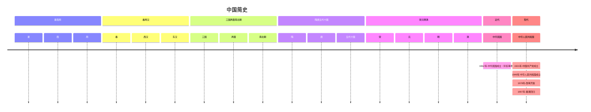

```mermaid
timeline
  title 中国简史
  section 夏商周
    夏
    商
    周
  section 秦两汉
    秦
    西汉
    东汉
  section 三国两晋南北朝
    三国
    两晋
    南北朝
  section 隋唐五代十国
    隋
    唐
    五代十国
  section 宋元明清
    宋
    元
    明
    清
  section 近代
    中华民国 : 1912年-中华民国成立（辛亥革命）
  section 现代
    中华人民共和国 : 1921年-中国共产党成立
    			: 1949年-中华人民共和国成立
    			: 1978年-改革开放
   				: 1997年-香港回归
```
