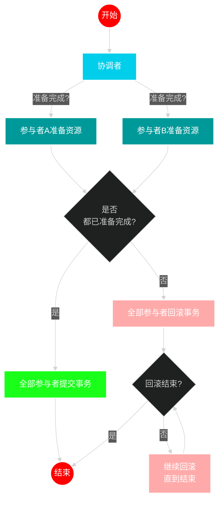
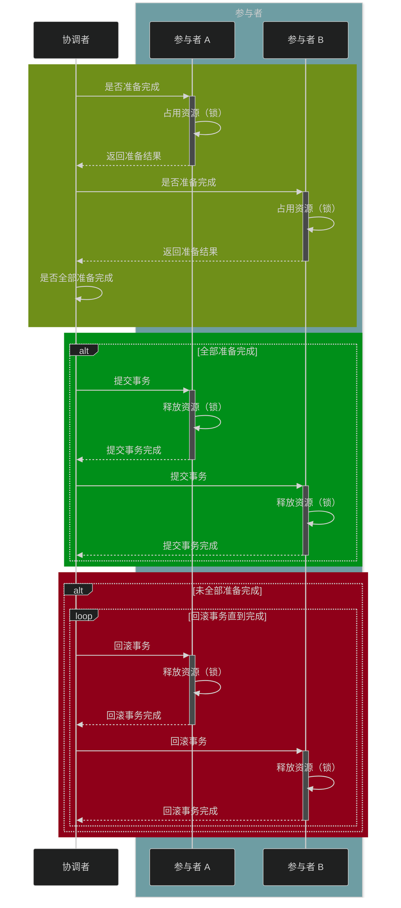
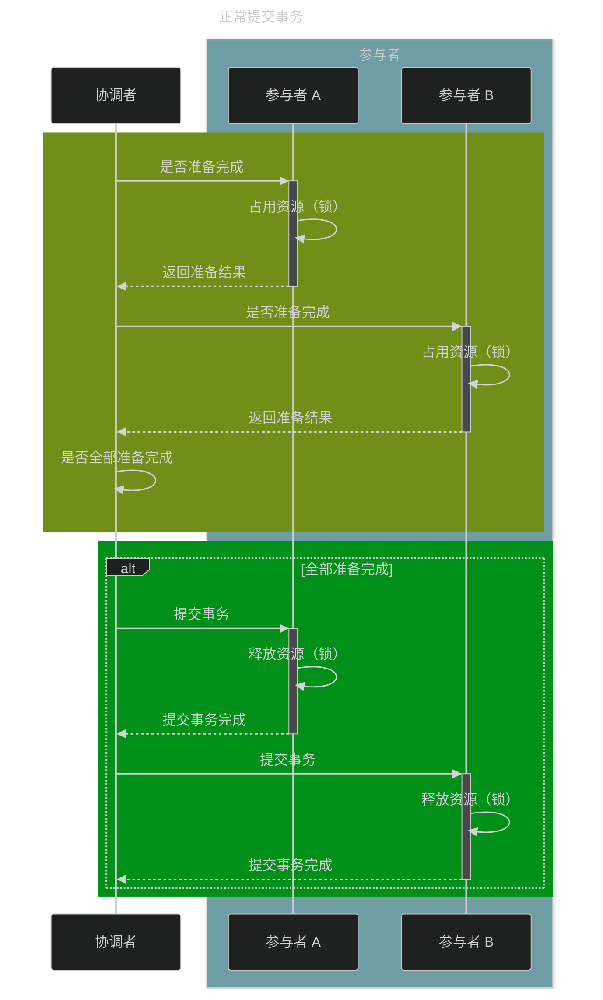
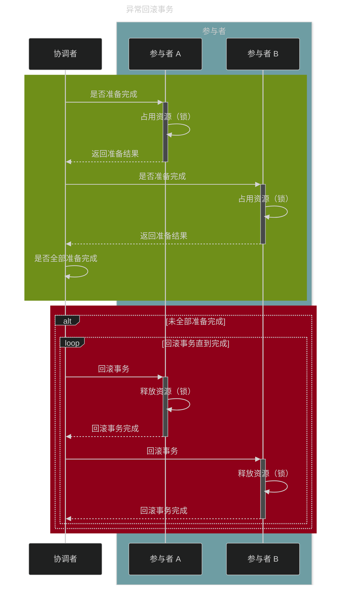

```mermaid
---
config:
  theme: 'dark'
---
flowchart TD

    start((开始))
    coordinator[协调者]
    participantA[参与者A准备资源]
    participantB[参与者B准备资源]
    checkReady{是否
    都已准备完成?}
    commit[全部参与者提交事务]
    rollback[全部参与者回滚事务]
    checkRollbackEnd{回滚结束?}
    continueRollback[继续回滚
    直到结束]
    e((结束))

    %% 流程连接
    start --> coordinator
    coordinator -->|准备完成?| participantA
    coordinator -->|准备完成?| participantB
    participantA --> checkReady
    participantB --> checkReady
    checkReady -->|是| commit
    commit --> e
    checkReady -->|否| rollback
    rollback --> checkRollbackEnd
    checkRollbackEnd -->|否| continueRollback
    continueRollback --> checkRollbackEnd
    checkRollbackEnd -->|是| e

    %% 节点样式（匹配原图配色）
    style start fill:#ff0000,stroke:#fff,color:#fff,stroke-width:2px
    style e fill:#ff0000,stroke:#fff,color:#fff,stroke-width:2px
    style coordinator fill:#00CEEB,stroke:#fff,color:#fff,stroke-width:2px
    style participantA fill:#009999,stroke:#fff,color:#fff,stroke-width:2px
    style participantB fill:#009999,stroke:#fff,color:#fff,stroke-width:2px
    style commit fill:#19FF19,stroke:#fff,color:#fff,stroke-width:2px
    style rollback fill:#FFAAAA,stroke:#fff,color:#fff,stroke-width:2px
    style continueRollback fill:#FFAAAA,stroke:#fff,color:#fff,stroke-width:2px
```

```mermaid
---
config:
  theme: 'dark'
---
sequenceDiagram
    participant coor as 协调者
    box rgba(2,96,109,0.5) 参与者
    participant pa as 参与者 A
    participant pb as 参与者 B
    end
    
    rect rgb(111, 143, 25)
    coor->>+pa : 是否准备完成
    pa->>pa: 占用资源（锁）
    pa-->>-coor:返回准备结果
    coor->>+pb : 是否准备完成
    pb->>pb: 占用资源（锁）
    pb-->>-coor:返回准备结果
    coor->>coor: 是否全部准备完成
    end
    rect rgb(00, 143, 25)
    alt 全部准备完成
    coor->>+pa : 提交事务
    pa->>pa: 释放资源（锁）
    pa-->>-coor:提交事务完成
    coor->>+pb : 提交事务
    pb->>pb: 释放资源（锁）
    pb-->>-coor:提交事务完成
    end
    end
    rect rgb(143, 00, 25)
    alt 未全部准备完成
    loop 回滚事务直到完成
    coor->>+pa : 回滚事务
    pa->>pa: 释放资源（锁）
    pa-->>-coor:回滚事务完成
    coor->>+pb : 回滚事务
    pb->>pb: 释放资源（锁）
    pb-->>-coor:回滚事务完成
    end
    end
    end
```

```mermaid
---
config:
  theme: 'dark'
---
sequenceDiagram
title: 正常提交事务
    participant coor as 协调者
    box rgba(2,96,109,0.5) 参与者
    participant pa as 参与者 A
    participant pb as 参与者 B
    end
    
    rect rgb(111, 143, 25)
    coor->>+pa : 是否准备完成
    pa->>pa: 占用资源（锁）
    pa-->>-coor:返回准备结果
    coor->>+pb : 是否准备完成
    pb->>pb: 占用资源（锁）
    pb-->>-coor:返回准备结果
    coor->>coor: 是否全部准备完成
    end
    rect rgb(00, 143, 25)
    alt 全部准备完成
    coor->>+pa : 提交事务
    pa->>pa: 释放资源（锁）
    pa-->>-coor:提交事务完成
    coor->>+pb : 提交事务
    pb->>pb: 释放资源（锁）
    pb-->>-coor:提交事务完成
    end
    end
    
```

```mermaid
---
config:
  theme: 'dark'
---
sequenceDiagram
title: 异常回滚事务
    participant coor as 协调者
    box rgba(2,96,109,0.5) 参与者
    participant pa as 参与者 A
    participant pb as 参与者 B
    end
    
    rect rgb(111, 143, 25)
    coor->>+pa : 是否准备完成
    pa->>pa: 占用资源（锁）
    pa-->>-coor:返回准备结果
    coor->>+pb : 是否准备完成
    pb->>pb: 占用资源（锁）
    pb-->>-coor:返回准备结果
    coor->>coor: 是否全部准备完成
    end
    
    rect rgb(143, 00, 25)
    alt 未全部准备完成
    loop 回滚事务直到完成
    coor->>+pa : 回滚事务
    pa->>pa: 释放资源（锁）
    pa-->>-coor:回滚事务完成
    coor->>+pb : 回滚事务
    pb->>pb: 释放资源（锁）
    pb-->>-coor:回滚事务完成
    end
    end
    end
```

