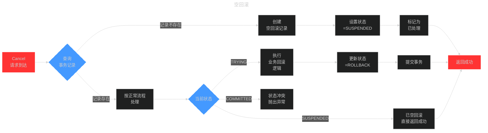
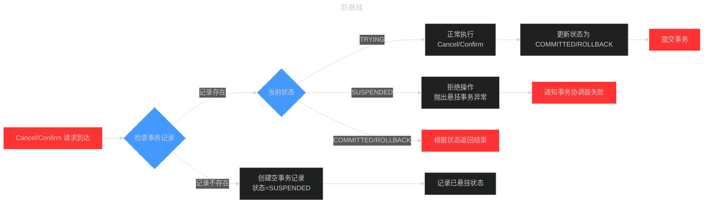
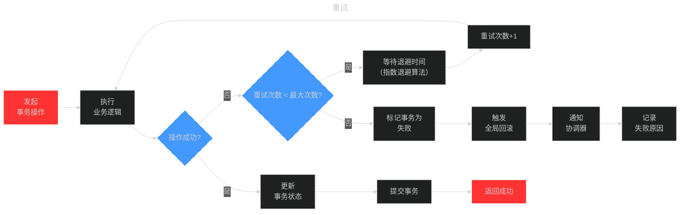
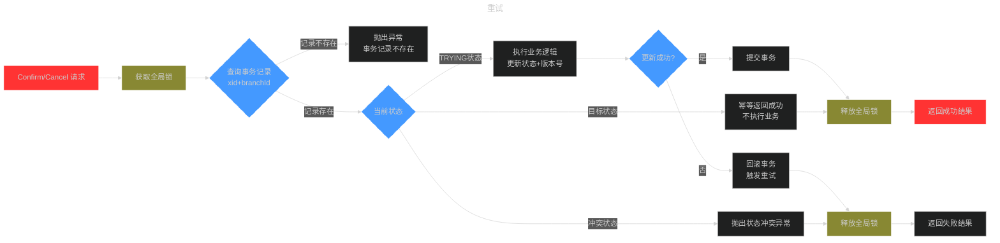
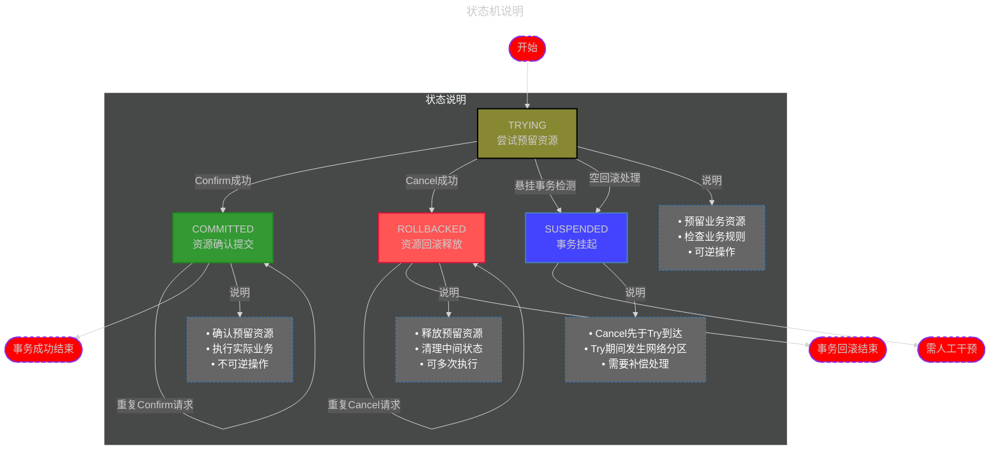

# Seata

Seata 是一款开源的分布式事务解决方案，致力于提供高性能和简单易用的分布式事务服务。Seata 将为用户提供了 AT、TCC、SAGA 和 XA 事务模式，为用户打造一站式的分布式解决方案。

## 各事务模式

### AT 模式

### TCC 模式

Try+Confirm/Cancel

#### TCC - 空回滚

未曾 Try 过先 Cancel，还没恋爱就分手。

空回滚指的是在一个分布式事务中，在没有调用参与方的 Try 方法的情况下，TM 驱动二阶段回滚调用了参与方的 Cancel 方法。

#### TCC - 防悬挂

已经 Cancel 如何 Try ? 恋爱结束来表白？

悬挂指的是二阶段 Cancel 方法比 一阶段 Try 方法优先执行，由于允许空回滚的原因，在执行完二阶段 Cancel 方法之后直接空回滚返回成功，此时全局事务已结束，但是由于 Try 方法随后执行，这就会造成一阶段 Try 方法预留的资源永远无法提交和释放，也就是悬挂了。

#### TCC - 重试机制（幂等处理）

参与者 执行完二阶段之后，由于网络抖动或者宕机问题，会造成 TC 收不到参与者 执行二阶段的返回结果，TC 会重复发起调用，直到二阶段执行结果成功。

##### 幂等处理

### TCC 状态机

### SAGA 模式

### XA 模式

