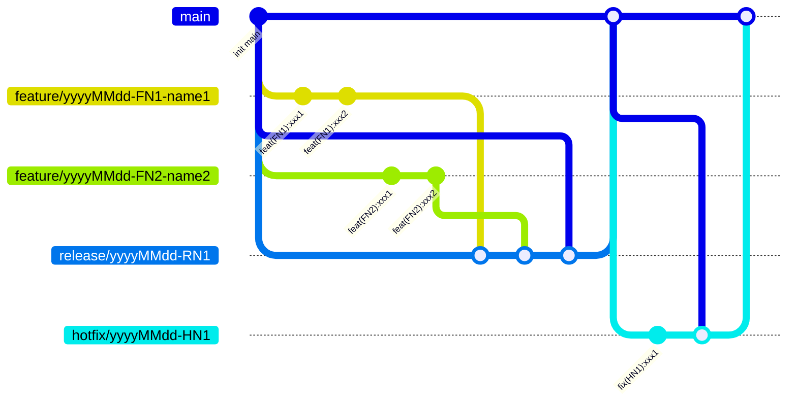

## 开发阶段

分支来源：main

分支命名：feature/{yyyyMMdd}-{FN1}-{name1}

目标分支：release/{yyyyMMdd}-{RNx}

yyyyMMdd：功能开发日期，如：2024-01-01

FN1：FeatureName 本次需求开发的所实现的功能名称，如：register

name1： 开发人员名称，如：lisi

## 测试阶段

分支来源：main

分支命名：release/{yyyyMMdd}-{RN1}

目标分支：main

yyyyMMdd：功能开发日期，如：2024-01-01

RN1：ReleaseName 本次迭代名称，如：account

## 生产阶段

分支来源：main

分支命名：hotfix/{yyyyMMdd}-{HN1}

目标分支：main

yyyyMMdd：修复日期，如：2024-01-01

HN1：HotfixName 本次修复名称，如：account
