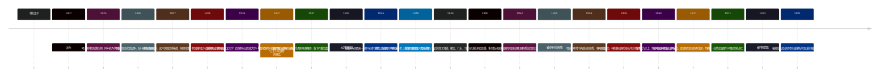

林彪（1907 年 12 月 5 日 —1971 年 9 月 13 日），原名林祚大，字阳春，号毓蓉，湖北黄冈人

```mermaid
---
config:
  logLevel: 'debug'
  theme: 'dark'
---
    timeline
        林彪生平
          1907 : 出生
          1925 : 考入黄埔军校第四期，同年转入中国共产党
          1926 : 毕业后投身北伐战争，在叶挺独立团担任排长
          1927 : 参与南昌起义，起义失败后随朱德、陈毅转战闽粤赣湘边界
          1928 : 参加湘南起义后随部队上井冈山
          1936 : 出任中国人民抗日红军大学（后改称抗日军政大学）校长，后兼政治委员
          1937 : 与聂荣臻共同指挥平型关战斗，打破了 “日军不可战胜” 的神话
          1937 : 被阎锡山部哨兵误伤，伤及肺和脊椎骨，留下严重后遗症，同年冬赴苏联就医
          1942 : 从苏联回国
          1945 : 在重庆与周恩来一同参与国共谈判；当选为中共中央委员、中央军委委员
          1948 : 指挥辽沈战役，解放全东北；指挥平津战役，攻克天津，和平解放北平（今北京）
          1949 : 任第四野战军司令员等职，先后指挥了湘赣、衡宝、广东、广西等战役，解放中南广大地区
          1950 : 旧伤引发的病症加重，多次赴苏联就医
          1954 : 任国务院副总理和国防委员会副主席
          1955 : 被授予元帅军衔
          1958 : 增选为中共中央政治局常委、中共中央副主席
          1959 : 庐山会议后，林彪兼任国防部长并主持军委日常工作
          1969 : 在中共九大上，作为毛泽东接班人被写进党章
          1970 : 在庐山召开九届二中全会，提议修宪恢复国家主席，明确国家副主席人选，未通过
          1971 : 在蒙古温都尔汗地区坠机身亡
          1973 : 被开除党籍
          1981 : 被最高人民法院特别法庭确认为反革命集团案主犯
          
```

