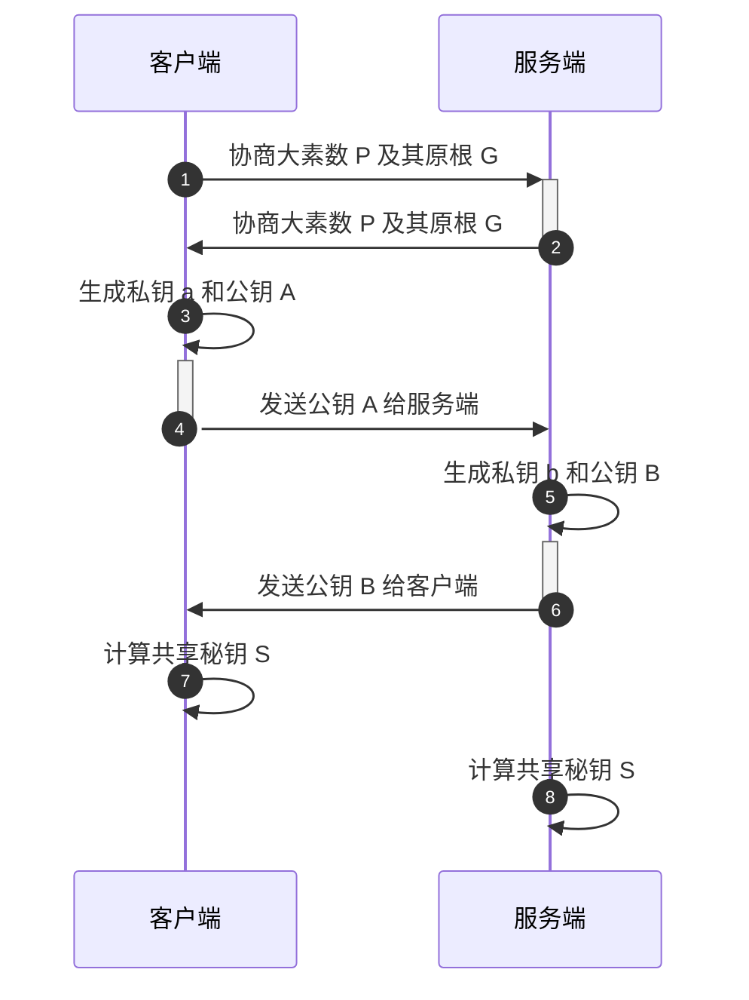
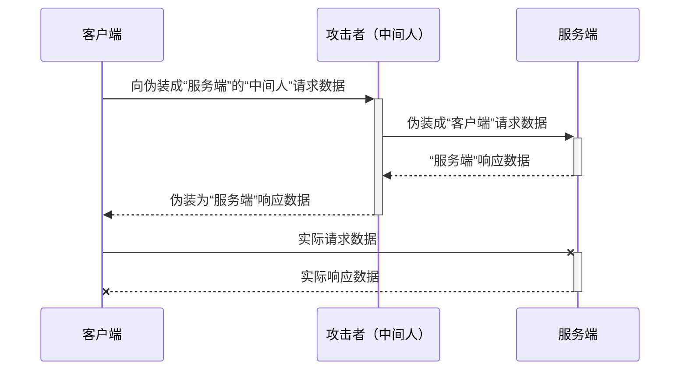

## Diffie-Hellman Key Exchange

**DHKE**是一种通过公共通道安全地交换加密密钥的数学方法，以Whitfield Diffie和Martin Hellman的名字命名。DH是密码学领域中最早实现的公钥交换实例之一。这两位也是《密码学的新方向》的作者。

Whitfield Diffie （左） and Martin E. Hellman （右）

## DHKE背后的数学
### 幂模运算
整数b(底数)的e次方(指数)除以正整数m(模)所得的余数c，就称为幂模。
$$
c = b^e \ mod \ m ( 0 <= c 且 c < m )
$$

假设 b=5、e=3、m=13， 则 c = 5³ mod 13 = 8 。

在上面的公式中，只要给定b、e、m，求模幂 c 的过程是非常高效的。

另一方面，**当m是素数时，给定b、c、m，求指数e的过程是很难的（离散对数难题）**。

这种单向函数的特性使模幂运算被多次用于密码算法中。

在 DHKE 协议中，我们取大素数 P 及其原根 G ，令 m=P，b=G，则幂模公式如下：
$$
c \ = \ G^e \ mod \ P \ ( 0<=c \ 且 \ c < P )
$$
且**幂模运算有个基本属性，DHKE协议正是基于这个属性工作的。**如下：
$$
(G^a)^b \ mod \ P = (G^b)^a \ mod \ P \ (G,a,b,p 是正整数)
$$

## DHKE 协议过程

基于幂模运算的数学基础，分析下DHKE协议的工作过程：

### 安全性

从 DHKE 协议的通信过程可见，只有G、P、A、B会在网络中进行传输，而a、b是不会通过网络进行传输的。同时，因为离散对数的难解，当G、P选的足够大时，通过A、B分别推算a、b是极其困难的。进而，**破解出最终的对称密钥S也是极其困难的。**

但是，由于 DHKE 本身不提供通信双方的身份验证。因此，**DHKE 容易受到中间人攻击（man-in-the-middle attack）**。

如果黑客以服务端的身份和客户端协商密钥，同时又以客户端的身份和服务端协商密钥。那么，黑客将会分别获得和客户端以及和服务端通信的密钥。通过这样的方式，黑客就可以用中间人的身份肆意的修改被共享密钥保护的信息了。

